
<h1>Krpano-roaming</h1>

 

 

# 你好！我是嘲笑鸟

VR全景是利用全景和虚拟现实技术，在互联网实现的可720度无死角观看的展现形式。就目前而言，VR全景除了在娱乐领域获得极大的成功外，在商业领域也成为了人们的焦点，被政府、景区、企业、校园、展会等广泛应用在营销推广上。那么，VR全景到底为什么如此受欢迎呢？

虽然说现在市面上有很多性价比极高的全景相机能够实现全景摄影，但是想要拍摄一个效果出众的全景摄影作品，还是乖乖拿出相机、云台和三脚架拍摄拼接吧。对于全景摄影的方法，想必很多人都有了一定的了解，不了解的在网上一搜也是一大把。

## 用到的工具  

  ：用来设计房屋。

  ：krpano生成漫游。

  ：超简单的漫游生成。

  ：填补全景图的漏洞。

  ：拼接全景图片。

  ：编码。  

## 用到的技术  
* java  
  

* javascript  

  
* css  

* html  

* spring boot  

* spring web  

* spring mybatis  

* spring mysql  

* spring alibaba  
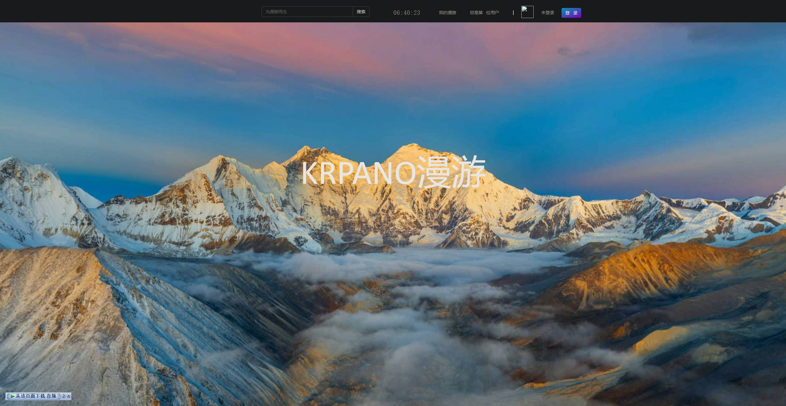
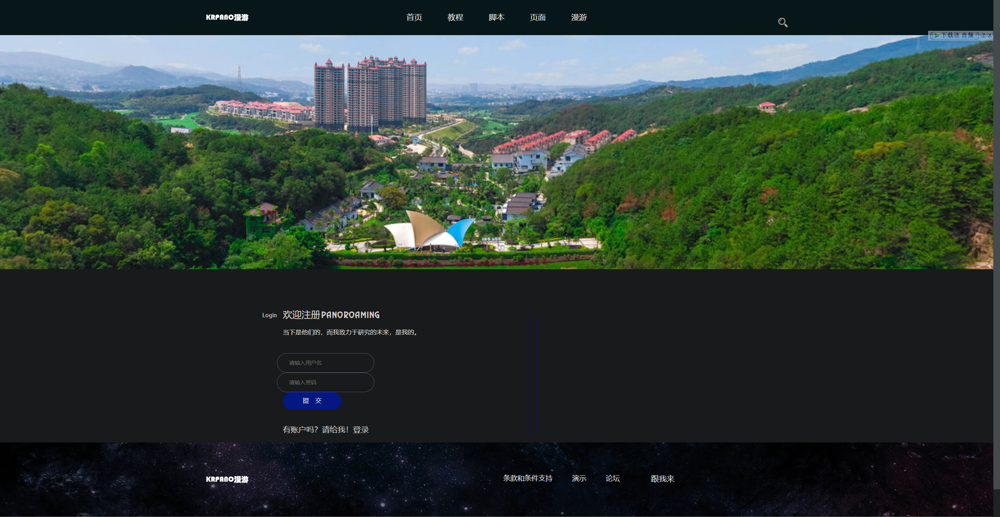
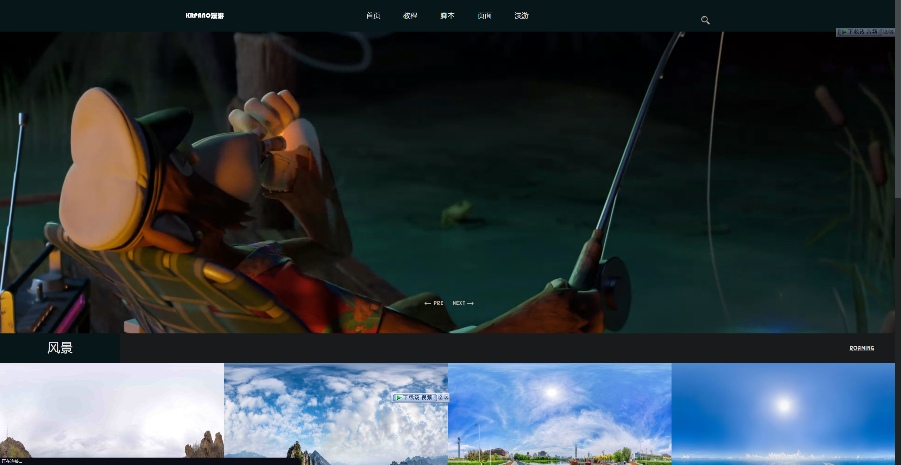
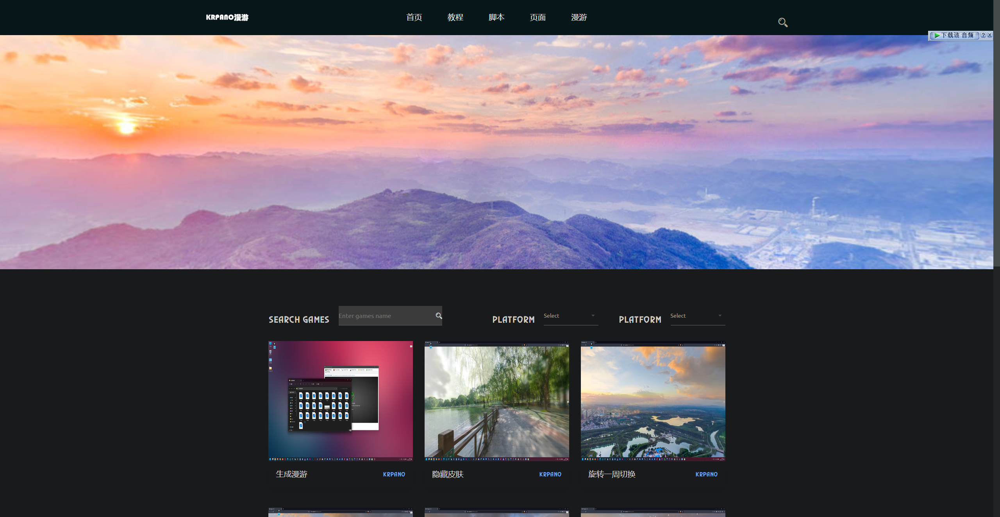
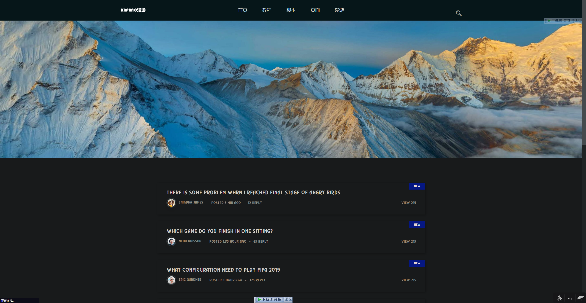
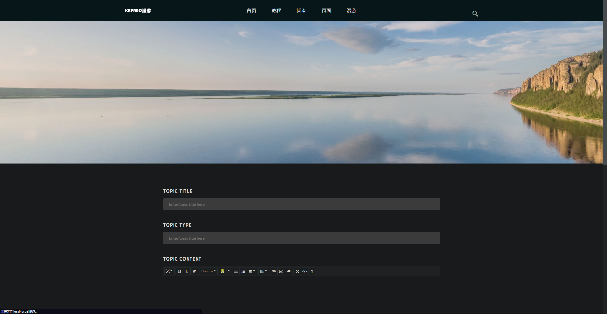
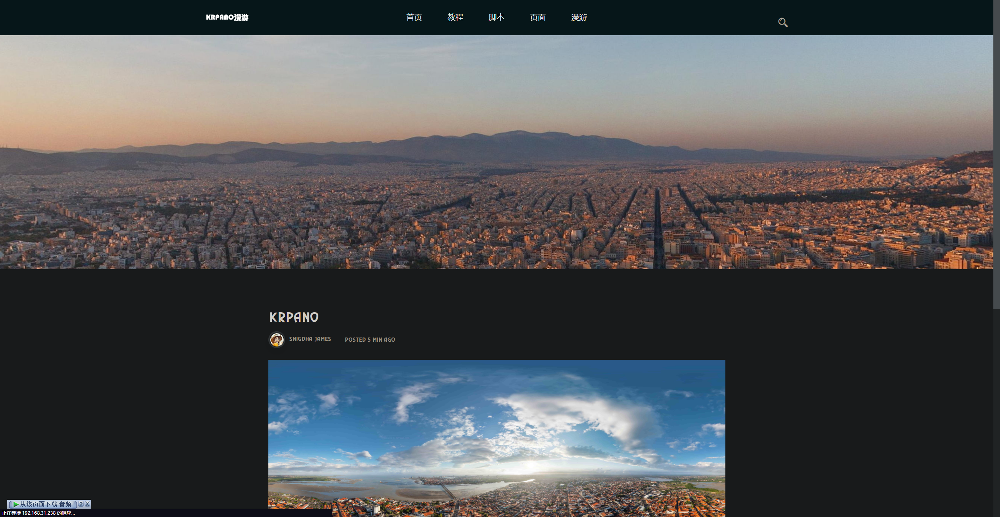
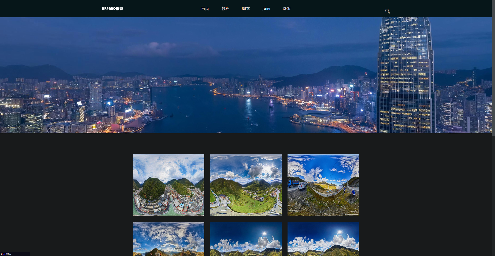
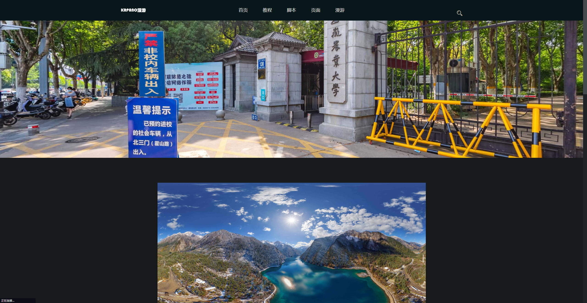
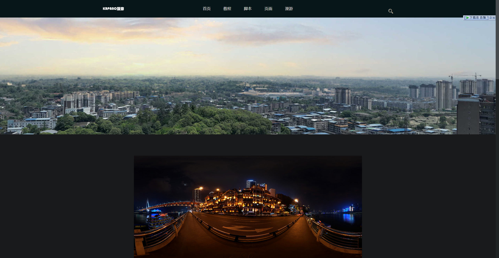

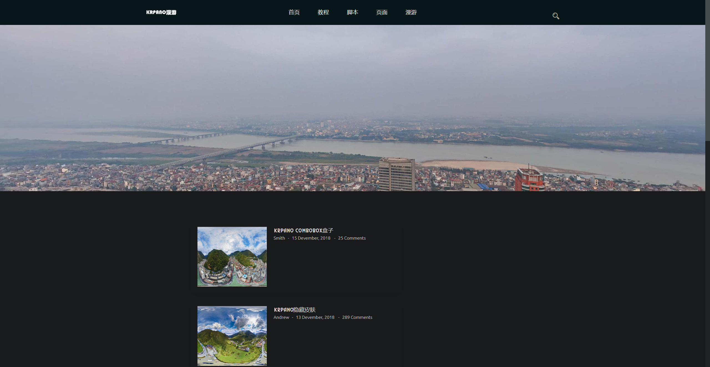
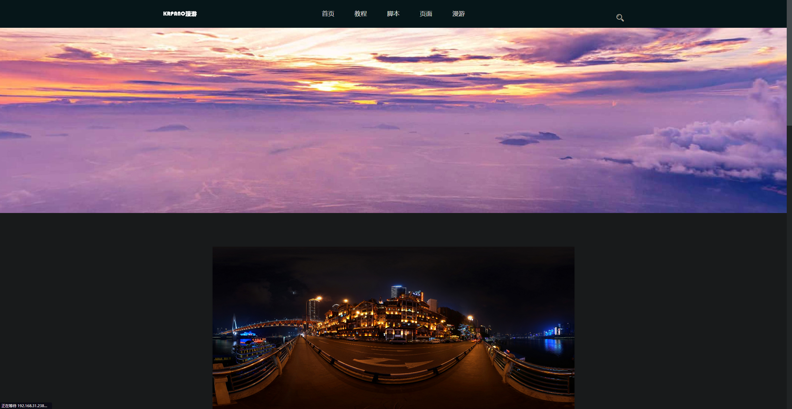
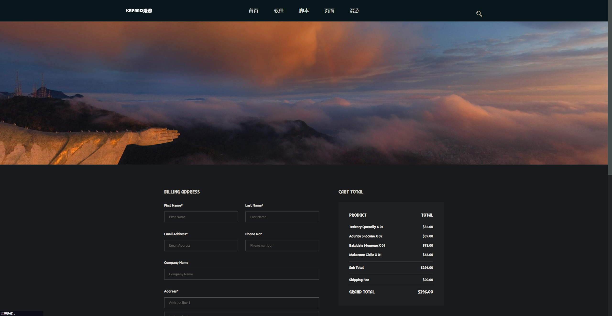
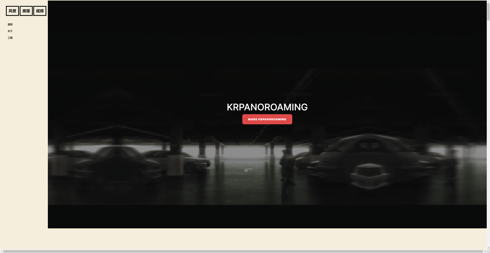
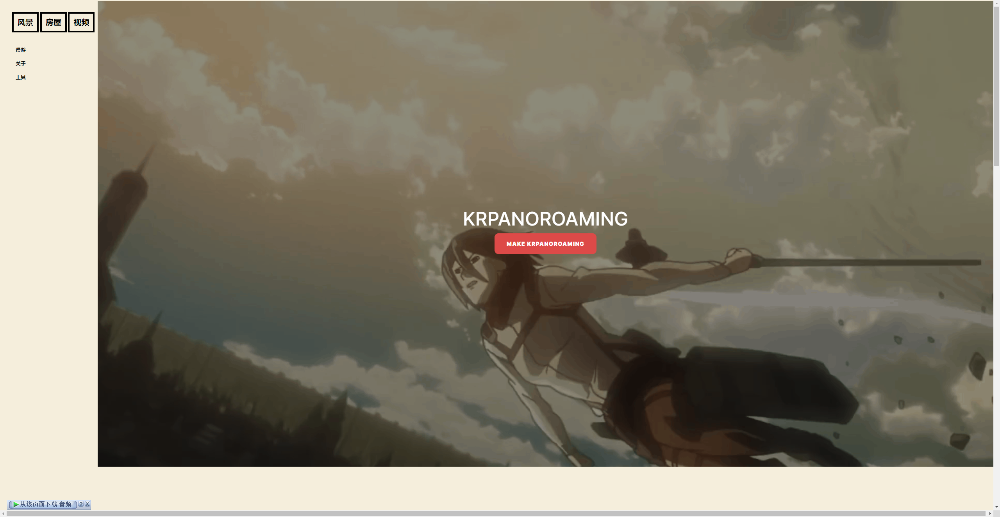
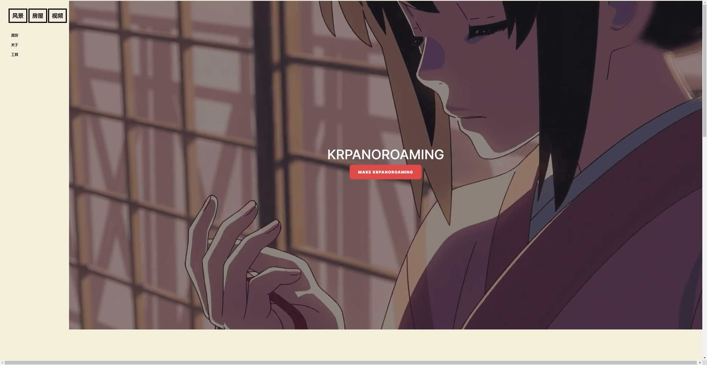

<iframe src="//player.bilibili.com/player.html?aid=433573635&bvid=BV1uG411M78w&cid=916162711&page=1" scrolling="no" border="0" frameborder="no" framespacing="0" allowfullscreen="true"> </iframe>

感谢：林里权 网友的源码支持